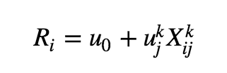

## Conjoint Analysis 
      

  <a href="#basic"> Basic Assumptions </a> •
  <a href="#steps"> Steps </a> •
  <a href="#imports"> Importing stuff </a>  

### Basic Assumptions

The basic assumptions of Conjoint Analysis are:
- Product are a bundle of attributes
- The utility of a product is a (simple) function of the utilities of each of its attributes
- Behavior such as purchases can be predicted from utilities

### Steps

- One must first choose the attributes to be included 
- The number of levels for each attribute must also be chosen
- Definition of hypothetical products (all combinations of attribute levels would generate too many products)
- One should make sure that:
 - All combinations of levels for pairs of attributes occur in some product 
 - The subset of products should have orthogonal design i.e. the chances of finding a given level of some attribute B in a product should be the same irregardless of the level of another attribute A. 
- Estimation of utilities (usually using ordinary linear regression with dummy variables)

The linear regression model with conjoint preference data has the form:

  

        
 

where, `R_i` is the ranking/rating assigned to product i, `X_{ij}^k` is a dummy variable which is 1 if product i has level j on attribute k and `u_j` is the utility coefficient for level j on attribute k. 

## To be continued.
